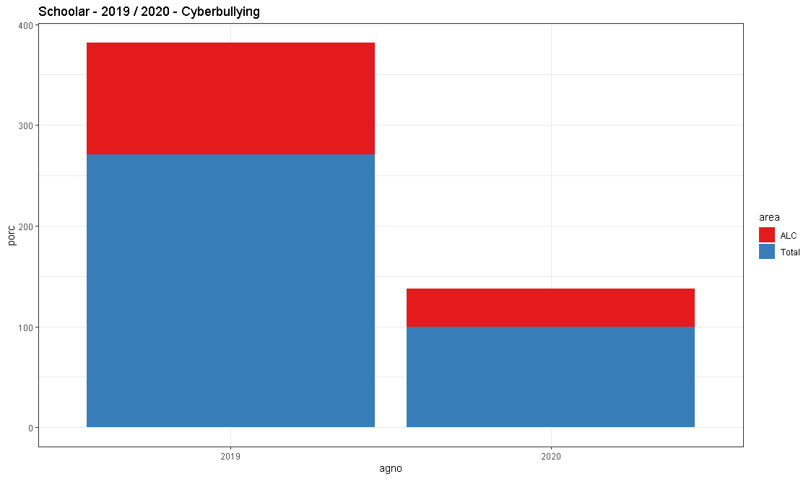

```{r, include=FALSE}
options(width = 60)
local({
  hook_output <- knitr::knit_hooks$get('output')
  knitr::knit_hooks$set(output = function(x, options) {
    if (!is.null(options$max.height)) options$attr.output <- c(
      options$attr.output,
      sprintf('style="max-height: %s;"', options$max.height)
    )
    hook_output(x, options)
  })
})
```

La producción de conocimiento sobre un fenómeno determinado es creciente y dinámico, en este caso, las publicaciones académicas, son un factor relevante al demarcar los antecedentes contextuales respecto a la 'Violencia Doméstica' y 'Cyberbullying', como términos claves desagregados en:  "Ciberacoso", "Ciberbullying" o "Cyberbullying", "Sexting", "Child grooming", "School bullying", "Violencia Domestica", "Violencia contra la mujer" o "Violence Against Women" ([Trends](webscrapping.html#resultados)). 

Es por lo anterior, la búsqueda de los términos señalados, se realizó las siguientes plataformas de investigación científica:


1) Scielo
2) Scopus
3) Web of Science - WoS
4) Scholar

 
Esta exploración se realizó en torno a preguntas como: ¿Qué contenido es posible encontrar a propósito de las materias mencionadas? ¿La investigación sobre las materias mencionadas se incrementa o decrece en la contingencia actual? ¿Qué énfasis le otorga Entendiendo este apartado, como un espacio para reflexionar sobre la importancia de las publicaciones académicas, las variaciones en la cantidad de publicaciones en cada medio,  del conocimiento y también considerar las dificultades que pueden presentarse en el respectivo proceso

## Contenido {.tabset}

### Scielo

La extracción de  información para Scielo se encuentra completa, pero la idea es que en este segmento haya una representación gráfica del contenido del Dataframe, así como el correspondiente análisis. En este caso, se dispone de la información completa para darle una estructura al sitio. 

El código para recolectar la información de Scielo, se encuentra especificado en el [Anexo | Scielo])(anexo.html#scielo). Por otro lado, a continuación se abre el DataFrame que contiene la información y se ordena de acuerdo a los valores ('value').

```{r echo=FALSE}

Scielo <- readRDS("academic_journals/data_of/data_rds/data_scielo.rds")
Scielo <- Scielo[order(-Scielo$value),]


```


```{r eval=FALSE}
Scielo <- readRDS("~/data_scielo.rds")
Scielo <- Scielo[order(-Scielo$value),]
```
Observando el siguiente resultado:
```{r echo=TRUE, max.height='200px'}
show(Scielo)
```


### Scopus

La extracción de  información para Scopus se encuentra completa, en este segmento irá la representación gráfica del contenido del Dataframe, así como el correspondiente análisis. En este caso, se dispone de la información completa para darle una estructura al sitio. 

El código para recolectar la información de Scopus, se encuentra especificado en el [Anexo | Scopus])(anexo.html#scopus). Por otro lado, a continuación se abre el DataFrame que contiene la información.

```{r echo=FALSE}

Scopus <- readRDS("academic_journals/data_of/data_rds/data_scopus.rds")
Scopus <- Scielo[order(-Scielo$value),]


```

```{r eval=FALSE}
Scopus <- readRDS("~/data_scopus.rds")
Scopus <- Scopus[order(-Scopus$value),]
```

Observando el siguiente resultado:

```{r echo=TRUE, max.height='200px'}
show(Scopus)
```

### Web of Science - WoS

La extracción de  información para Web of Science se encuentra completa, en este segmento irá la representación gráfica del contenido del Dataframe, así como el correspondiente análisis. En este caso, se dispone de la información completa para darle una estructura al sitio. 

El código para recolectar la información de Web of Science, se encuentra especificado en el [Anexo | Web of Science])(anexo.html#wos). Por otro lado, a continuación se abre el DataFrame que contiene la información.

```{r echo=FALSE}

WoS <- readRDS("academic_journals/data_of/data_rds/data_webofscience.rds")
WoS <- WoS[order(-WoS$value),]


```

```{r eval=FALSE}
WoS <- readRDS("~/data_webofscience.rds")
WoS <- WoS[order(-WoS$value),]

```

Observando el siguiente resultado:

```{r echo=TRUE, max.height='200px'}
show(WoS)
```

### Scholar

La extracción de  información para Scholar se encuentra completa, en este segmento irá la representación gráfica del contenido del Dataframe, así como el correspondiente análisis. En este caso, se dispone de la información completa para darle una estructura al sitio. 

El código para recolectar la información de Scholar, se encuentra especificado en el [Anexo | Scholar])(anexo.html#scholar). Por otro lado, a continuación se abre el DataFrame que contiene la información.

```{r echo=FALSE}

Scholar <- readRDS("academic_journals/data_of/data_rds/data_scholar.rds")
Scholar <- Scholar[order(-Scholar$value),]

```

```{r eval=FALSE}
Scholar <- readRDS("~/data_scholar.rds")
Scholar <- Scholar[order(-Scholar$value),]

```

Observando el siguiente resultado:


```{r echo=TRUE, max.height='200px'}
show(WoS)
```


### Publicaciones por país

En la región se observa un decrecimiento de investigaciones sobre el cyberbullying o ciberacoso entre los años 2019 y 2020, siendo ese decrecimiento proporcional a la cantidad de estudios revisados por cada año:


```{r eval=FALSE}
ggplot(data=data_graf,aes(x=agno,fill=area)) + 
        geom_bar(aes(y=porc),
                 stat='identity', position="stack")+
        scale_fill_brewer(palette="Set1")+
        theme_bw()+
        labs(title = "Schoolar - 2019 / 2020 - Cyberbullying")
```





Por otro lado al revisar por país los estudios provenientes de Colombia, han aumentado, a diferencia de México que en proporción han disminuido en la misma fecha.  

```{r eval=FALSE}
geo_school=ggplot() +
        geom_sf(data = map_plot,aes(fill = hits),color = "whitesmoke",size=0) +
        scale_fill_viridis_c()+
        theme_bw()+
        facet_grid(~ agno) +
        labs(title = "Schoolar - 2019 / 2020 - Cyberbullying")

plot(geo_school)
```


