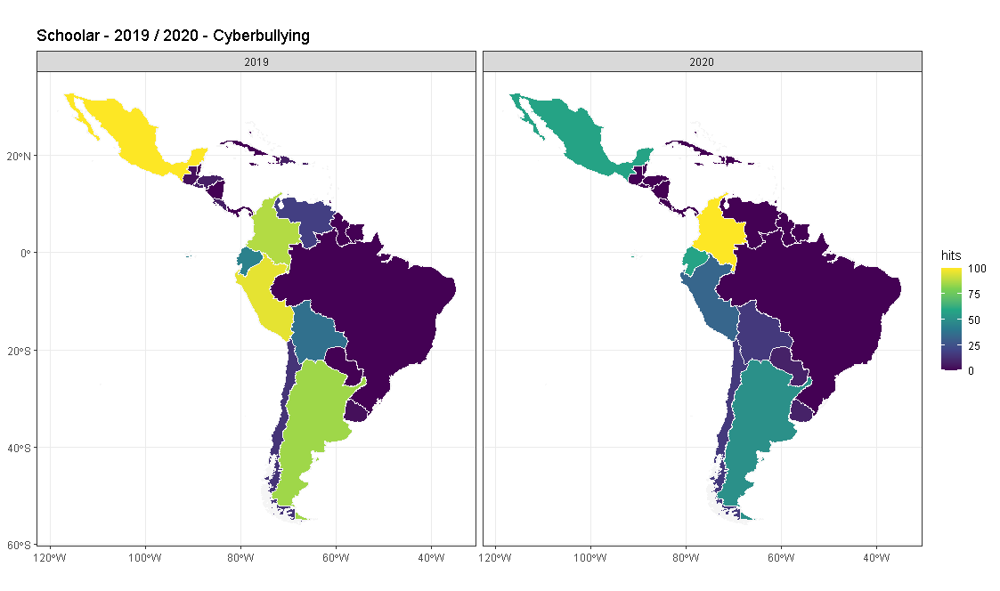

```{r setup, include=FALSE}
knitr::opts_chunk$set(echo = TRUE)
```

## Objetivo

Existen nuevos métodos para comprender el impacto que tiene la violencia de género, violencia doméstica, el cyberacoso o el cyberbuying. Entre ellos, mediante un análisis terciario, nos preguntamos  ¿Qué contenido en Google Scholar es posible encontrar a propósito de las materias mencionadas? ¿La investigación sobre las materias mencionadas se incrementa o decrece en la contingencia actual? 
En una instancia posterior, podría ser útil identificar iniciativas, políticas o programas que los gobiernos de la Región de América Latina y el Caribe hayan puesto en marcha para denunciar situaciones de cyberbullying, violencia y abuso sexual durante el confinamiento por COVID-19. 


## Contenido {.tabset}

### Resultados | Output

#### Cyberbuying

En la región se observa un decrecimiento de investigaciones sobre el cyberbullying o ciberacoso entre los años 2019 y 2020, siendo ese decrecimiento proporcional a la cantidad de estudios revisados por cada año:


Por otro lado al revisar por país los estudios provenientes de Colombia, han aumentado, a diferencia de México que en proporción han disminuido en la misma fecha.  




