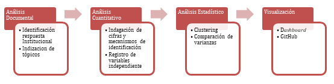
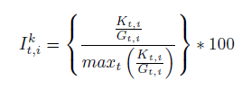

```{r setup, include=FALSE}
knitr::opts_chunk$set(echo = TRUE)
```


# {#contenido}
<div class=text-justify>

El presente documento presenta los avances de los resultados obtenidos durante el análisis de la investigación, considerando los modelos y metodologías utilizadas, visualizaciones, correlaciones y testeos y demás información que se considera relevante para el objetivo del proyecto con respecto a la consultoría solicitada por el Banco Interamericano de Desarrollo (en adelante BID). Con la finalidad de facilitar la exploración en herramientas técnicas que comprenden: analíticas de textos, minería de datos y scraping Data, entre otros. 
 

## 1. Introducción {#introduccion}
A finales del año 2019 la región de Latinoamérica y el Caribe, se enfrentó a un nuevo desafío sanitario frente a la emergencia mundial asociada a la propagación de una cepa infecciosa, de la familia del coronavirus, también denominada COVID-19 (WHO, 2020). De este modo, a medida que los países afectados, adoptan medidas sanitarias, institucionales, tecnológicas y de orden público, los organismos internacionales y la prensa en general, dieron aviso del aumento en la violencia a la que se encontraban expuestos: mujeres y Niños, Niñas y Jóvenes (en adelante, NNJ).

Desde los 80’, se empezaba a considerar en varios países de la región, que la violencia doméstica era un problema importante para la salud pública, adquiriendo diversas formas, entre ellas la agresión psicológica y/o física. Sin embargo, entre las formas frecuentes de violencia doméstica, predominaba la violencia perpetrada hacia la mujer, que en su forma más extrema escalaba a femicidio (Carrington et al., 2020; López, 2020; Mascarenhas et al., 2020; Olivera, 2006). Por otra parte, los estudios la violencia en NNJ, han debido incorporar la tecnología como un medio, que en determinadas ocasiones facilita la exposición a la violencia, surgiendo el ciberacoso como una expresión de vulneración de derechos fundamentales que ha alertado a organismos internacionales en la última década (Alfaro, 2020; Cardozo, 2020; Marquina Ghezzi, 2020).

Dicho lo anterior, diferentes crisis se han relacionado con un aumento de la violencia interpersonal (Cohn & Kutalek, 2016). Sin embargo, probablemente solo en la actualidad es posible observar un fenómeno de crisis a raíz del surgimiento del COVID-19, en un contexto donde la tecnología y el uso de las redes sociales ha estado tan masificado. Entre Las medidas de prevención sanitaria de distanciamiento social, confinamiento en el hogar, así como el cierre de establecimientos educacionales para enfrentar la pandemia, pusieron de relieve la dependencia de la tecnología como canal principal de comunicación.

La adopción de las redes sociales y el internet en general, como forma de comunicación en tiempos de confinamiento han permitido la proliferación de una comunidad virtual que no necesariamente se preocupa por el otro, sino que ha manifestado en más de un caso, respuestas violentas que coartan la libertad de expresión. De este modo, a principios del 2019 la UNICEF (2019) advirtió: Sobre los peligros que generan la violencia en línea, el ciberacoso y el acoso digital para el 70,6% de los jóvenes de 15 a 24 años que están conectados en todo el mundo, y pidió medidas conjuntas para abordar y prevenir la violencia contra los niños y los jóvenes en línea” (UNICEF, 2019)

Por otro lado, durante el mes de mayo del año 2020, se dieron a conocer otras noticias desde diferentes lugares de América Latina y el Caribe asociadas al confinamiento, que daban cuenta del aumento de la violencia doméstica. Entre ellas, el 20 de abril del año 2020, la ONU (2020) declaraba “las denuncias por violencia de género aumentan un 39% en Argentina durante la cuarentena por el coronavirus y, desde que comenzó el confinamiento, el 20 de marzo, se han producido 19 feminicidios” (ONU, 2020). En mayo, la académica Svenska Arensburg (2020) advertía una agudización de la violencia doméstica propósito del confinamiento domiciliario, indicando que: Se nos viene encima la desigualdad y la discriminación de género, en el sentido de que la vida cotidiana estaba organizada con la mujer asumiendo su trabajo en el espacio público, y en la administración material, afectiva y del tiempo en el espacio privado. Pero ahora ni siquiera tiene esos dos espacios para poder administrarse, sino que ahora tiene que generar esas condiciones en el mismo espacio doméstico (Universidad de Chile, 2020).

En este contexto, el 20 de julio del año 2020, la representación del Banco Interamericano de Desarrollo en Chile decide realizar una investigación sobre la respuesta de los gobiernos de la región de América Latina y el Caribe, frente al incremento de situaciones de violencia doméstica y exposición al ciberacoso en NNJ, en el contexto de las medidas de confinamiento en el hogar producto de la aparición del COVID-19 en el mundo. Esto, con el propósito de clasificar información existente en torno a medidas de prevención, y brindar herramientas para la toma de decisiones en política de cada uno de los gobiernos subyacentes.

El presente informe presenta en primer lugar, el proceso metodológico de carácter mixto, mediante las cuales se realizó la recolección de información, así como el análisis de datos. En segundo lugar, se presentan los resultados de los datos extraídos de la web con sus análisis aplicados.


## 2.	Proceso Metodológico {#metodologia}
La identificación de iniciativas, leyes, programas, entre otras formas de respuesta de los gobiernos de la región de América Latina y el Caribe, ante el aumento de situaciones de violencia doméstica efectuadas sobre mujeres y exposición al ciberacoso en NNJ, en el contexto de las medidas de confinamiento producto del COVID-19. Implican hacer caso a la advertencia de la prensa y medio social, por el reconocimiento del incremento de formas específicas de violencia, producto de medidas de confinamiento que han implementado en diferentes países de América Latina y el Caribe. De este modo, la pregunta que guio la presente investigación es la siguiente:
</div>
<div class=text-center>
**¿Qué influencia ejercen las medidas de confinamiento, implementadas por el surgimiento del COVID-19 en América Latina y el Caribe, sobre la exposición a situaciones de violencia doméstica efectuadas sobre mujeres y ciberacoso en NNJ?**
</div>
<div class=text-justify>
A la pregunta anterior, es importante añadir que como condición no se realizará ningún proceso de control, sino que eminentemente los pasos para dar respuesta a ella pertenecen a un modelo metodológico observacional (Arnau et al., 1990), donde estrategias cualitativas como cuantitativas sean complementarias y útiles para tal propósito. Para responder a la pregunta anteriormente señalada, se generaron los siguientes objetivos específicos, por cada uno de los países que componen América Latina y el Caribe:

-	Identificar las formas de respuesta institucional frente a la exposición a situaciones de violencia doméstica efectuadas sobre mujeres y ciberacoso en NNJ.

-	Indizar tópicos adecuados a cada contexto territorial, que permitan seleccionar expresiones adecuadas para referirse a situaciones de violencia doméstica efectuadas sobre mujeres y ciberacoso en NNJ.

-	Indagar en cifras y mecanismos de medición sobre la exposición a situaciones de violencia doméstica efectuadas sobre mujeres y ciberacoso en NNJ.

-	Registrar variables independientes que contextualicen las situaciones de violencia doméstica efectuadas sobre mujeres y ciberacoso en NNJ en cada país.

-	Analizar mediante estadística multifactorial, datos que permitan comprobar si las variables identificadas ejercen un nivel de influencia estadísticamente significativa, sobre la exposición a situaciones de violencia doméstica efectuadas sobre mujeres y ciberacoso en NNJ.

### 2.1.	Esquema Metodológico {#esquema}
Para el desarrollo del modelo metodológico observacional se desarrollaron los objetivos anteriormente expuestos, desde una búsqueda documental, posteriormente cuantitativa, para desarrollar un análisis estadístico multifactorial, terminando con una visualización de los resultados. 
</div>

<div class=text-center>


</div>
<div class=text-justify>

Para este informe se desarrollará la metodología utilizada para el análisis documental, desde la indización de tópicos, análisis cuantitativo, análisis estadísticos y sus respectivos resultados.

### 2.2.	Análisis Documental {#analisis}
Indización de tópicos adecuados a cada contexto territorial
La acción de indizar refiere a la identificación de tópicos con relación a un tema, que de acuerdo con el volumen de la información, puede ser un trabajo de largo plazo (Gil Leiva & Rodríguez Muñoz, 1996). Sin embargo, esta estrategia nos permite seleccionar expresiones adecuadas para describir situaciones de violencia doméstica efectuadas sobre mujeres y ciberacoso en NNJ. Realizándose una exploración de medios digitales, en cuyo caso, la información extraída permitirá una evaluación del contexto en la región, sobre temáticas asociadas a la inequidad de género como raíz de la violencia doméstica ejercida contra la mujer y ciberacoso como raíz de violencia en línea ejercida sobre NNJ.

De esta forma, es relevante señalar que se reconoce la existencia de un sesgo al automatizar la búsqueda masiva de contenido, cuya desventaja guarda relación con la especificidad de esta, priorizando analizar miles de datos en detrimento de un análisis detallado caso a caso. Se sopesó la dificultad señalada, mediante la incorporación de “keywords” o palabras clave que saturen el fenómeno. Siendo importante tener en cuenta un periodo de exploración de la información, como también una perspectiva amplia para captar la serie de términos asociados a la “violencia”, que pueden tener un significado diferente de acuerdo con cada país de la región.

De esta forma, para obtener una aproximación sobre la situación del ciberacoso, y violencia doméstica entre los años 2019 y 2020, en la región de Latinoamérica y el Caribe. Se realizó una recopilación de datos de mediante una consulta masiva en línea, respecto a los siguientes tópicos: ciberacoso, cyberbullying, ciberbullying, violencia doméstica, violencia contra la mujer y violence against women. Dicho lo anterior, fue necesario indagar en las consultas que se hayan realizado en Google, específicamente en: noticias, sitios web y YouTube. Para esto se desarrolló una analítica de búsquedas en la web. 
Analítica Web.

La extracción y estudio de información relevante sobre un tema online, que sea de apoyo para la toma de decisiones, corresponde a la analítica web, que ha desarrollado diferentes herramientas que permiten la captura cuantitativa de la actividad y comportamiento de los usuarios en un sitio web para los investigadores de la comunicación digital y la toma de decisiones.  

El uso del Internet como herramienta de información se ha exponenciado en el último tiempo, teniendo como uno de los motores de búsqueda principal a Google. De acuerdo con las estadísticas de Internet Live Stats existen más de 4.000.000.000 de usuarios de internet, y se realizan más de 3.000.000.000 de búsquedas por segundo en Google. 

Google recopila la información de términos y expresiones que utilizan los usuarios por medio de un análisis estadístico, lo que se le denomina search analytics, y forma parte del campo de la cibermetría (Orduña- Malea; Aguillo, 2015). En este ámbito, ofrece la plataforma Google Trends, que permite las búsquedas de una palabra o sentencia en un periodo de tiempo definido por el usuario, el indicador que mide estas búsquedas se denomina el índice de Google que es un indicador relativo que asigna el valor máximo de 100 al periodo que contengan la búsqueda mayor del tiempo definido.
</div>

<div class=text-center>

<div class=text-center>
Donde:
Ikt,i : I es el índice de Google del periodo t, en la zona geográfica para la búsqueda del término k.

Kt,i : Cantidad de búsquedas del término de interés para el periodo t en la zona geográfica.

Gt,i : Total de búsquedas realizadas en el periodo t en la zona geográfica i.

</div>