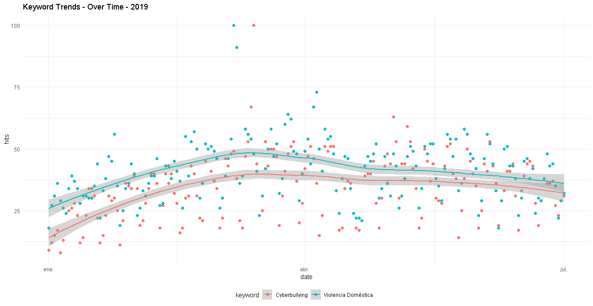

```{r setup, include=FALSE}
knitr::opts_chunk$set(echo = TRUE)
```


Para obtener una aproximación sobre la situación de violencia de género, cyberbullying, acoso y violencia doméstica entre los años 2019 y 2020, en la región de Latinoamérica y el Caribe. En conjunto con el Banco Interamericano de Desarrollo -BID, se ha realizado una recopilación de datos de mediante una consulta masiva en línea, respecto a los siguientes tópicos:

- "Ciberacoso"
- "Cyberbullying" o "Ciberbullying"
- "Violencia Domestica",
- "Violencia contra la mujer" o "Violence Against Women"

Dicho lo anterior, fue necesario indagar en las consultas que se hayan realizado en Google, específicamente en: noticias, sitios web y Youtube. En tanto, para cada uno de los títulos anteriores, se compararon los años 2019 y 2020, en un rango establecido entre el 1 de enero y 1 de julio, para cada año respectivamente. Con la finalidad, de hacer un análisis respecto a 4 ámbitos desagregados en los siguientes títulos:

*1) Topics Over Time:* Que refiere a consultas sobre términos clave a lo largo de un rango temporal específico.

*2) Related Queries Over Time:* Que refiere a las consultas relacionadas a los tópicos principales, y que permiten detallar la exploración realizada en el punto anterior.

*3) Interest Over Time:* Indica en el rango específico de tiempo, como se ha modificado la tendencia respecto a consultas asociadas a "Cyberbullying" y "Violencia Doméstica".

*4) Mapping Topics in Latin America and Caribbean:* Se realiza una revisión de las consultas realizadas por país, en Latinoamérica y el Caribe.

Por útlimo, es importante señalar que la presente documentación tiene como objetivo  facilitar la disposición del  *Resultados*, *Especificaciones técnicas | Script* y *Términos de entrada*. Para que la información pueda ser ser reutilizada, reproducida o modificada de acuerdo al criterio de los investigadores y u otros objetivos que pudiesen surgir de  este proyecto.


### Resultados{#resultados}

#### 1. Topics Over Time

En primer lugar, se ha indagado en los términos: "Ciberacoso", "Cyberbullying" o "Ciberbullying", "Violencia Domestica", "Violencia contra la mujer" o "Violence Against Women", para el rango temporal indicado en la introducción.

En ambos años no se observan grandes diferencias en el tópico más buscado para "Cyberbuying", aunque existe un descenso en búsquedas sobre "school bullying" entendido como el "acoso escolar" en el años 2020 y un incremento sobre el "Sexting" que refiere a un interés por el envío de mensajes eróticos o de caracter sexual a través de telefonía móvil o redes sociales.

De igual modo, se observa que en el año 2020, hay un incremento de las búsquedas que refieren al término "Child Grooming", entendidas como una acción emprendida por un adulto a través de las redes sociales, para entablar un vínculo sobre un menor de edad. En cualquiera de los casos, ya sea de "Sexting" o "Child Grooming" se observa en general una intención por dañar la integridad psicológica o física, de un menor de edad. 

Por otro lado,  en "Violencia Doméstica" los tópicos mayormente relacionados son "Violence ", "Woman",  "Female", "child", entre otros. Indicando en primer lugar, que los términos relacionados a la búsqueda de la violencia doméstica no han variado significativamente entre los años 2019 y 2020. Y en segundo lugar, que si bien la violencia doméstica puede ser un tipo de violencia física o psicológica ejercida contra cualquier persona o grupo de personas, independiente de la identidad de género, cuando se busca en la redes sociales sobre este término, se identifica una violencia ejercida sobre mujeres o niños. 

```{r eval=FALSE, include=FALSE}
topics_tbl = readRDS("Gtrends_web_news_ytb/topics_tbl19.rds")
topics=topics_tbl %>%
        ggplot(aes(value, interest, color = keyword)) + 
        geom_segment(aes(xend = value, yend = 0))+
        geom_point()+
        coord_flip()+
        facet_wrap(~ keyword, nrow = 1, scales = "free_y")+
        theme_tq()+
        scale_color_tq()+
        ggtitle("2019")+
        theme(plot.title = element_text(hjust = 0.5))

plot(topics)

```


**En el [Código | Topics 2019](anexo.html#topics2019) puedes revisar en detalle los resultados del Script.** 
```{r eval=FALSE, include=FALSE}
topics_tbl = readRDS("Gtrends_web_news_ytb/topics_tbl20.rds")
topics=topics_tbl %>%
        ggplot(aes(value, interest, color = keyword)) + 
        geom_segment(aes(xend = value, yend = 0))+
        geom_point()+
        coord_flip()+
        facet_wrap(~ keyword, nrow = 1, scales = "free_y")+
        theme_tq()+
        scale_color_tq()

plot(topics)
```


*En el [Código | Topics 2020](anexo.html#topics2020) puedes revisar en detalle los resultados del Script.


#### 2. Related Queries Over Time

Cuando se observan las consultas relacionadas a los términos: "Ciberacoso", "Ciberbullying", "Cyberbullying", "Violencia Domestica", "Violencia contra la mujer" y "Violence Against Women", entre 1 de enero y 1 de julio, de los años 2019 y 2020 respectivamente. Es posible detallar la exploración realizada sobre las palabras clave indicadas en la sección anterior.

En el caso del "Cyberbullying", ya sea porque no tiene una antigüedad como lo es la "Violencia Doméstica", porque no esté tan masificado o porque sea un fenómeno ligado ampliamente a la tecnología, presenta consultas relacionadas un nivel de acercamiento primario a un objeto. Preguntas como ¿Qué es el Cyberbullying?, ¿Qué es el ciberacoso? o  ¿Cuáles son sus definiciones?, implican un acercamiento exploratorio, por parte de quienes realizan las consultas. A diferencia de "Violencia Doméstica", donde radica la búsqueda sobre sanciones, tipos, cantidad, consultas del tipo ¿Ley de violencia contra la mujer? o sobre ¿Cuál es la cantidad de denuncias?, lo cual indica que es un proceso aceptado, validado, concreto, reglamentado, etc.

Otra diferencia que se aprecia entre las consultas relacionadas a "Violencia Doméstica", entre los años 2019 y 2020, es "violencia doméstica en cuarentena", término prácticamente inexistente entre enero y julio del 2019.

```{r eval=FALSE, include=FALSE}
topics_tbl = readRDS("queries_tbl19.rds")
topics=topics_tbl %>%
        ggplot(aes(value, interest, color = keyword)) + 
        geom_segment(aes(xend = value, yend = 0))+
        geom_point()+
        coord_flip()+
        facet_wrap(~ keyword, nrow = 1, scales = "free_y")+
        theme_tq()+
        scale_color_tq()+
        ggtitle("2019")+
        theme(plot.title = element_text(hjust = 0.5))

plot(topics)
```

 
```{r eval=FALSE, include=FALSE}
topics_tbl = readRDS("queries_tbl20.rds")
topics=topics_tbl %>%
        ggplot(aes(value, interest, color = keyword)) + 
        geom_segment(aes(xend = value, yend = 0))+
        geom_point()+
        coord_flip()+
        facet_wrap(~ keyword, nrow = 1, scales = "free_y")+
        theme_tq()+
        scale_color_tq()+
        ggtitle("2020")+
        theme(plot.title = element_text(hjust = 0.5))

plot(topics)
```

 

#### 3. Interest Over Time

Respecto a la tendencia de las consultas entre los años 2019 y 2020, es posible determinar que el 2019 las consultas sobre "Violencia Doméstica" tienen en promedio una brecha permanente con "Cyberbullying" y mantienen una tendencia al incremento hasta llegar a abril, donde se observa que ambas curvas comienzan a decrecer.  


Por otro lado, en el año 2020 al pasar el mes de abril, se invierte la tendencia, ya que en promedio las consultas sobre Cyberbullying resultan ser mayores que las asociadas a "violencia doméstica".


#### 4. Mapping Topics in Latin America and Caribbean
 

Existe un movimiento en las consultas realizadas por cada una de las regiones de Latinoamérica y el Caribe, entre los años 2019 y 2020. El interés por el "Cyberbullying" y la "Violencia Doméstica" se han incrementado en general, existiendo variaciones específicas por país. Entre las variaciones más notorias se encuentran:

- En el caso de Chile, el interés por el "Cyberbullying" pasa a otro plano en el año 2020. Mientras que la "Violencia Doméstica" no ha sido una búsqueda de interés en ninguno de los dos años.
- Otro caso, es el de Perú, que en el año 2020 ha incrementado el interés en la búsqueda del "Cyberbullying", en tanto, las busquedas por "Violencia Doméstica" han disminuido para dicho año.
- México incrementa su búsqueda en el año 2020 por "Violencia Doméstica", mientras "Cyberbullying" se mantiene.

```{r eval=FALSE, include=FALSE}
map_plot=st_read("map_plot.shp")

geo_word= ggplot() +
        geom_sf(data = map_plot,aes(fill = hits),color = "whitesmoke",size=0) +
        scale_fill_viridis_c()+
        theme_tq()+
        facet_wrap(~ keyword, nrow = 1) +
        labs(title = "Keyword Trends - Word")

plot(geo_word)
```
 


